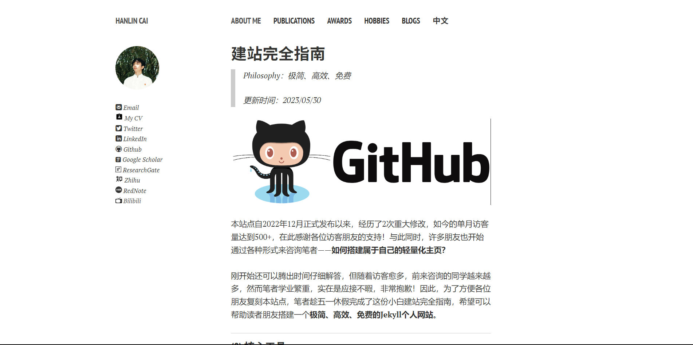
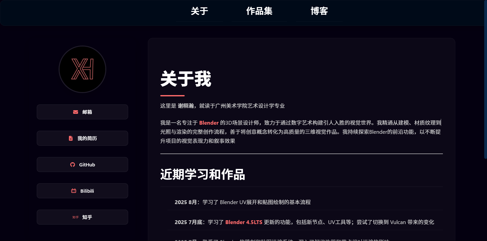

# 课程学习与反思

## 起步

使用腾讯元宝上的DeepSeek模块进行提问：如何高效快捷地建立个人网站以展示个人简历，元宝给出几个可行方案->我选择使用 [Github](https://github.com) 的托管服务（Page）进行网站的搭建（因为它是免费的，而且可以实时更新）。

---

## 初期

基于 [Jekyll](https://jekyllcn.com/docs/usage/) 模板创建基础样式，将一些内容替换为自己的信息；再更换主题颜色并填充一些别的内容。JekyII会将我的Markdown（一种文本格式）文件渲染为网页并赋予预先设置好的样式。

在更换主体等的阶段，遇到了一系列问题：我发现如果连续询问AI的次数越多，AI的回答质量会越来越随机、不可控，我必须在必要的时候开启新对话；构建网站的过程中也遇到了不少教程里没有提到的问题，我被这些问题卡住了很久的进度，甚至想过另寻他路。

---

## 后期

有时Github会因为网络连接问题导致很难上传网站的更新；有时也会有莫名其妙的报错，因为这个网站是在别人的基础上构建的，我必须一步步熟悉原项目的结构，才能更好地配合DeepSeek发现并解决问题。但最终还是做出来了:joy:。

最后，来看一下我“改造”的成果吧。

{:.responsive}

---

{:.responsive}

---

## 学习新事物

在这段时间里，我还初步学习了Markdown这种扩展性强的文本格式，进一步美化了我的作品集和网页。

还有AI图片和视频生成，这里我使用元宝的AI生图工具生成了视频的首尾帧，然后使用即梦生成10s的视频，连续这样操作几次，最后拼接成30s的视频。总体而言，即梦还是很不错的，可以生成4K的视频，但是视频的连贯性不是很强（可能是首尾帧信息跨度太大了？）。下面是我灵机一动想的概念——一座天空之城坠向地面，伴随着天空的异变和飞溅的沙石。（这是我下一个作品的初步灵感，刚好让AI生成一些图片和视频看看效果，不过结果显然是不怎么样，我应该学习一下怎么尽量避免视频衔接不流畅的问题）=> [AI视频](/video/learn.mp4){:.responsive}
