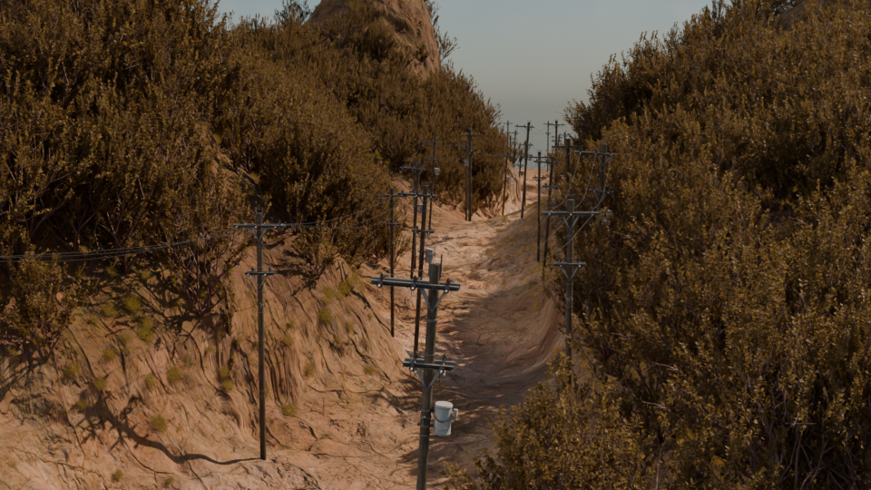
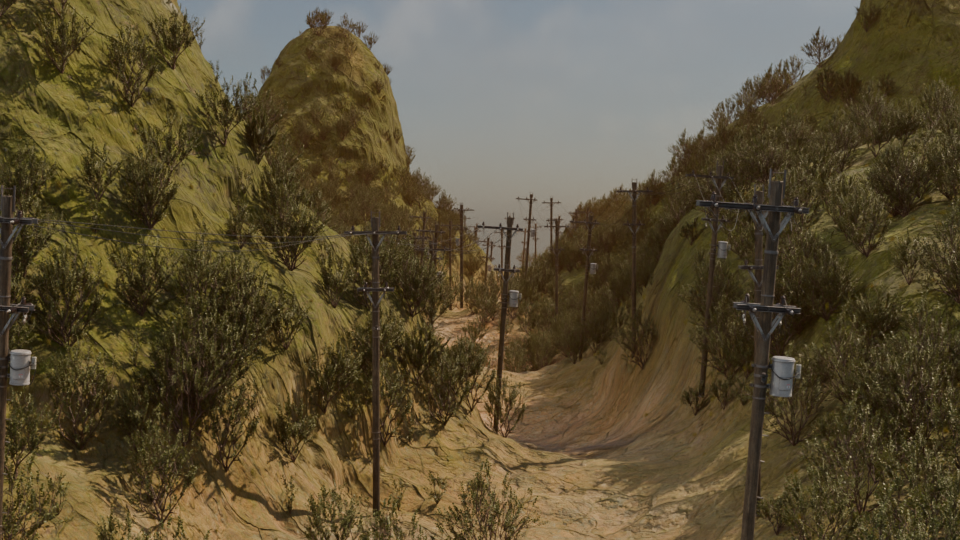
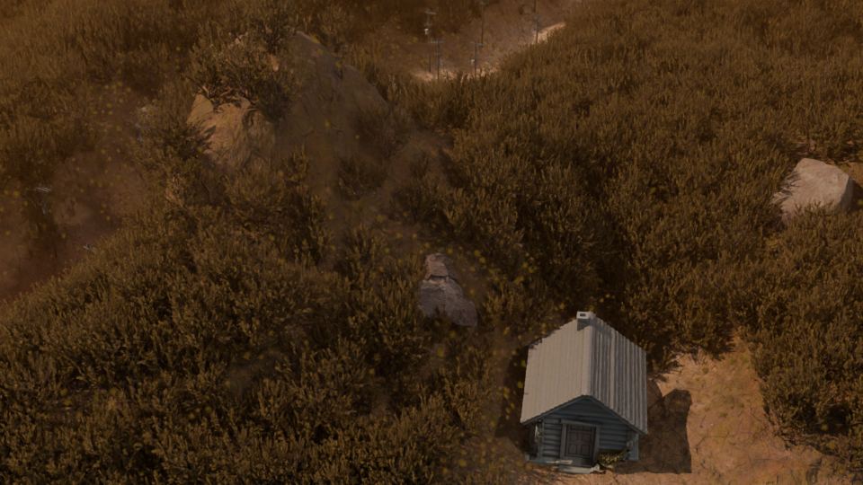
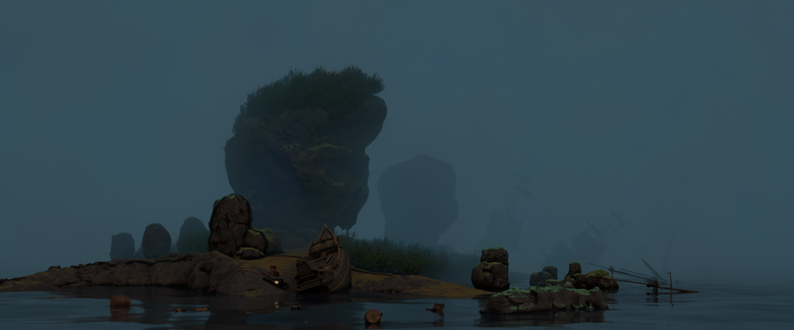
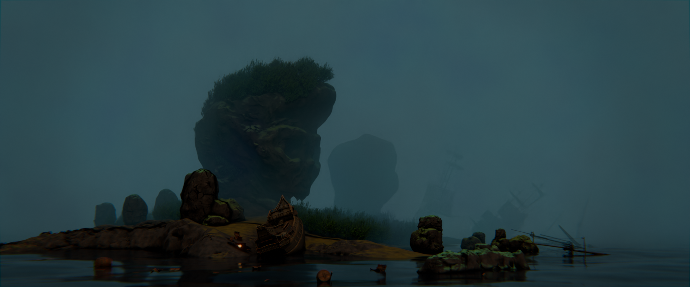
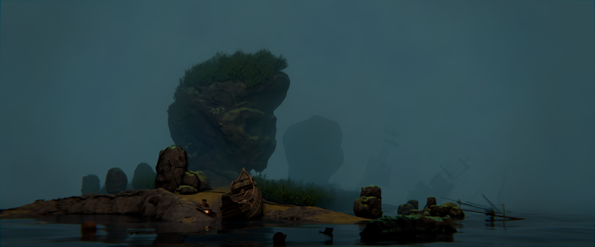

# 作品集

## 山地

这是一个山地场景，废弃的物品和房子让这座山看似人迹罕至，与自然景观形成对比

{:.responsive}

进一步细化，添加石头和体积雾，让场景更加真实

{:.responsive}

换个视角看看

{:.responsive}

---

## 海岛

这是一个弥漫着死亡气息的海岛，整体构图为三角构图。

{:.responsive}

开启合成器后的效果

{:.responsive}

进一步打光

{:.responsive}

---
